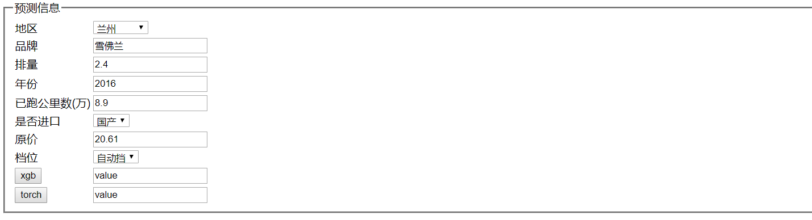

# second_car
second car predict test
## 步骤
* 安装pandas, xgboost, sklearn

 _pip3 install pandas xgboost scikit-learn_
 
 * 将t_car.csv放到跟second_car.py同级目录下
 
* 安装tensorflow

_pip3 install tensorflow_

* 安装flask,MySQL数据库驱动

_pip3 install flask pymysql_

* 安装 seaborn画图工具库

_pip3 install seaborn

* 安装pytorch 神经网络库

_window系统 pip3 install torch==1.3.0+cpu torchvision==0.4.1+cpu -f https://download.pytorch.org/whl/torch_stable.html_
_mac系统 pip3 install torch torchvision_

## 启动应用
python app.py

在浏览器地址栏输入 http://localhost:5000 显示如下页面：

